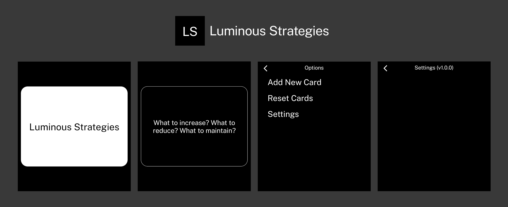

An app that lets you choose a card from Brian Eno's Oblique Strategies to inspire your creatvity.

## Installation

The latest .apk file is available in [releases](https://github.com/ak-nattyb/Luminous-Strategies/releases/latest).

I recommend using [Obtainium](https://github.com/ImranR98/Obtainium) and adding the repository's URL to receive updates.

## Features

- Press on a card to flip it over
- Long press on a card to add a new card, reset cards to stock and access settings

## Acknowledgements

Huge thank you to the following projects:

- Vandam's Light Template: [light-template](https://github.com/vandamd/light-template)
- Ceejbot's strategies.txt: [oblique-strategies](https://github.com/ceejbot/oblique-strategies/blob/master/strategies.txt)

## Support

Send me (rustybeets) a message on the Light Phone discord if you run into any issues!

If you find this app useful and want more apps like it to exist, [consider sponsoring Vadam](https://github.com/sponsors/vandamd)! :)
